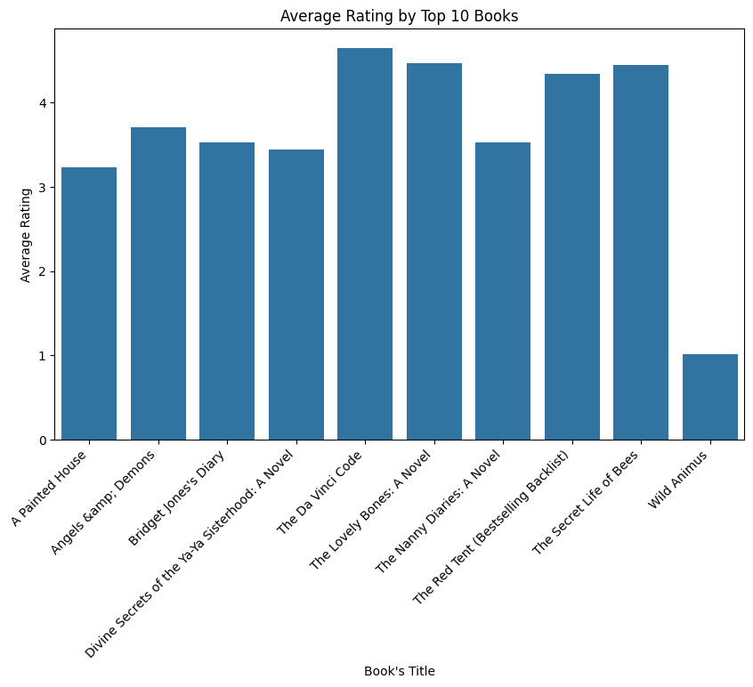
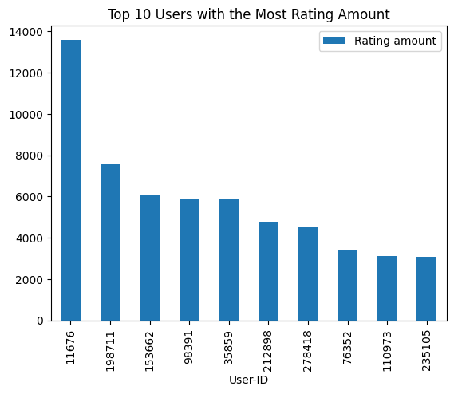

# **Recommendation System: Automating Book's Suggestion using Collaborative Filtering**

By    : Muhammad Fatih Idlan (faiti.alfaqar@gmail.com)

This project was done to fulfil the *Machine Learning Terapan* 2nd assignment submission on Dicoding. The domain used in this project is book recommendation.

## Project Overview
In today’s digital age, the volume of content and choices available to users across platforms is overwhelming. Recommender systems play an indispensable role in navigating this vast landscape, ensuring users discover relevant and engaging content without being inundated by irrelevant options. By personalizing user experiences, these systems have become a cornerstone in industries like e-commerce, entertainment, and education, boosting user satisfaction, retention, and revenue. This project delves into the development of a book recommendation system, leveraging collaborative filtering techniques and the Nearest Neighbors algorithm to match users with books they are most likely to enjoy. Collaborative filtering, a widely used approach, relies on user-item interactions to uncover patterns and provide recommendations. Furthermore, Collaborative Filtering can make unforeseen recommendations, which means it might offer items that are relevant to the user even if the information is not in the user's profile [[ 1 ]](https://doi.org/10.1016/j.eij.2015.06.005). The system implementation is aimed to demonstrate how machine learning can be harnessed to create a seamless and personalized user experience in the context of literature discovery.

## Business Understanding
### Problem Statement
Starting with explanation from the background above, core problems that this project aims to solve are:

* How to develop a machine learning-based recommendation system for books?
* How are the results when data with and without normalization is compared using the same algorithm?

### Objectives
According to problem statement above, this project has several objectives too, that are:

* Develop a machine learning-based recommendation system for books
* Determining high performance model with variation of data preparation method

### Solution Approach
To achive the objectives, we need to perform several things such as:

* Using Nearest Neighbour through variation of data with and without normalization to selecting high performance corresponding to evaluation metrics (Euclidean Distance)

## Data Understanding

The dataset that used in this project is Book Recommendation Dataset, which can be accessed through kaggle [[ 2 ]](https://www.kaggle.com/datasets/arashnic/book-recommendation-dataset). This dataset consist of 3 csv files, Books.csv (271360 rows with 8 columns), Ratings.csv (1149780 rows with 3 columns), and Users.csv (27885 rows with 3 columns), also has 3 png file which irrelevant in this project. The explanation for each column can be seen below:

For Books.csv, the column are consist of:
* ISBN = International Standard Book Number of the books inside obtained from Amazon Web Services
* Book-Title = Title of the books obtained from Amazon Web Services
* Book-Author = The Author of the books obtained from Amazon Web Services
* Year-Of-Publication = Publication year of the books obtained from Amazon Web Services
* Publisher = The Publisher of the books obtained from Amazon Web Services
* Image-URL-S = URL for small sized Book's cover images point to the Amazon web site
* Image-URL-M = URL for medium sized Book's cover images point to the Amazon web site
* Image-URL-L = URL for large sized Book's cover images point to the Amazon web site

For Ratings.csv, the column are consist of:
* User-ID = Anonymized user identification in integers
* ISBN = International Standard Book Number of the books inside obtained from Amazon Web Services
* Book-Rating = Rating of the books, expressed on a scale from 1-10 (higher values denoting higher appreciation) in an explicit way, or expressed by 0 in implicit way

For Users.csv, the column are consist of:
* User-ID = Anonymized user identification in integers
* Location = Region of the reader in form of city, country
* Age = Age of the readers

### Exploratory Data Analysis (EDA)
Conducting exploratory data analysis, including univariate analysis consisting of book's rating distribution, top 10 book amount also top 10 users with the most amount of rating.

#### Univariate Analysis
*  Distribution of Book Ratings

*  Top 10 Books Amount

*  Top 10 Users with the Most Rating Amount

#### Important Key Points from EDA
*   Most of the rating is retrieved in implicit way, so we can just drop that to receive more representable results 
*   "Selected Poems" and "Little Women" have the highest amounts, indicating strong popularity or frequent selection
*   The remaining users in top 10 have a much smaller number of ratings compared to the top two, indicating a long-tail distribution. This could mean a mix of power users and casual users in the dataset
*   High activity from a few users could introduce bias in your model, skewing recommendations toward their preferences. Mitigating this with normalization or weighting techniques might be critical.

## Data Preparation
Before model development step, it is inevitable to skip data preparation. This section is important, preparing data so the data that enter model development stage is not generating a trash model. It is start with data cleaning which removing empty data using pandas data frame method, drop_dropna(). Later, combine the rating and book dataframe into pivot table to reveal patterns in user-book interactions. The last thing to do is value standardization of the data to perform efficiently by ensuring that different variables are treated on a common scale, since this project use an algorithm that rely in distance metrics (Nearest Neighbour). But this done through varying it into standardize data and un-standardize data, so there will be 2 variation that we want to compare with the same algorithm.

### Standardization
In order to scaling the dataset value, we can use standardization method. It transform the dataset in such a way to have a mean of 0 and standard deviation of 1. Moreover, standardization method is the superior scaling technique for medium and large dataset [[ 3 ]](https://ieeexplore.ieee.org/document/10681438).

## Model Development
The data, which is likely a matrix of user-item interactions (book ratings), will be prepared and stored in a DataFrame. We then fit the KNN model to this data using 
fit() method. This training process allows the model to learn the relationships between book based on user preferences. After training, the model can be used to predict the rating a user might give to an item they haven't interacted with or to find the 'N' most similar items to a given item, forming the basis of a recommendation system.

## Evaluation
The metrics evaluation used for this step is Euclidean Distance  
$$d(\mathbf{p}, \mathbf{q}) = \sqrt{\sum_{i=1}^n (p_i - q_i)^2}$$
 

Where:
* $$d(\mathbf{p}, \mathbf{q})$$: Represents the Euclidean distance between two points 𝑝 and 𝑞
* $$\mathbf{p}_i$$ : The 𝑖-th coordinate of point 𝑝
* $$\mathbf{q}_i$$ : The 𝑖-th coordinate of point 𝑞
* 𝑛 : The number of dimensions

Euclidean distance is a measure of similarity or dissimilarity between two points in a multi-dimensional space. It calculates the straight-line distance between two vectors (e.g., user preferences, book features) in 𝑛-dimensional space. Euclidean distance helps measure the quality of predictions in terms of how closely the system matches a user's preferences. This metric is suitable for recommendation system, because it calculate the shortest straight-line distance between two points which describe the similiarity between two or more users [[ 4 ]](https://www.geeksforgeeks.org/euclidean-distance/).

### Performance of Each Recommender System

|index|Recommended Title w/ Standardization|Recommended Distance w/ Standardization|Recommended Title w/o Standardization|Recommended Distance w/o Standardization|
|---|---|---|---|---|
|0|The Bean Trees|13\.210874318725459|The Bean Trees|0\.0|
|1|She's Come Undone \(Oprah's Book Club \(Paperback\)\)|18\.25312417493501|She's Come Undone \(Oprah's Book Club \(Paperback\)\)|20\.71231517720798|
|2|Message in a Bottle|19\.175551891499328|The Book of Ruth \(Oprah's Book Club \(Paperback\)\)|20\.97617696340303|
|3|The Book of Ruth \(Oprah's Book Club \(Paperback\)\)|20\.004643098492593|A Heartbreaking Work of Staggering Genius|21\.540659228538015|
|4|Where the Heart Is \(Oprah's Book Club \(Paperback\)\)|20\.127327140139407|Prodigal Summer: A Novel|22\.561028345356956|
|5|Midnight in the Garden of Good and Evil: A Savannah Story|20\.308733957555393|Message in a Bottle|22\.58317958127243|
|6|Prodigal Summer: A Novel|20\.330839049718872|She's Come Undone \(Oprah's Book Club\)|22\.693611435820433|
|7|The Hours: A Novel|20\.336413030797384|Mystic River|23\.2163735324878|
|8|A Heartbreaking Work of Staggering Genius|20\.42423929077602|The Queen of the Damned \(Vampire Chronicles \(Paperback\)\)|23\.2379000772445|
|9|1984|20\.60415091109995|While I Was Gone|23\.853720883753127|

From metric evaluation table above, we can conclude that Nearest Neighbour with standardization data pre-processing algorithm is the most desired algortihm because has the average lowest euclidean value value for top-N recommendation comparing to same model but without standardization pre-processing.

### Model Prediction
This step is carried out to see how each machine learning algorithm predicting the target data (source pressure).

|index|y\_true|dimension|LR|KNN|ANN|
|---|---|---|---|---|---|
|770|601|0\.25246995242719095|580\.21152119611|590\.6|577\.8556518554688|

From the figure above, we can compare how prediction data and real data from each machine learning algorithm (K-Nearest Neighbour, Linear Regression, Dense Neural Network). Clearly, Linear Regression generated data point in a straight line. K-Nearest Neighbour generated data points that gather in one area. Then Dense Neural Network seems to struggle with its predictions forming a smoother but lower curve that doesn't capture the wide spread of real data.

### Conclusion
After building this project, we can answer the problem statement and fulfil our objectives that we set before in business understanding section. Also, by implementing solution statement, we can easily achieve them (the answer of problem statements and fulfil the objectives), due to heatmap visualization of correlation matrix to understand interaction of each variables and the usage of MSE metrics to identify the best model from several machine learning algorithm (K-Nearest Neighbour, Dense Neural Network, and Linear Regression).
* From correlation matrix visualization using heatmap, we can see that among all variables that do not have a strong influencial to dependent variable, source input pressure (mmH2O), there is several variables have a correlation point up to 0.5 indicating high influential presence, that are Air flowrate in zone 1 (NM3/H.1PV), Air flowrate in zone 2 (NM3/H.2PV), Desired air flowrate in zone 1 (NM3/H.1SV), and Desired air flowrate in zone 2 (NM3/H.2SV).
* With correaltion point up to 0.5 for NM3/H.1PV, NM3/H.2PV, NM3/H.1SV, and NM3/H.2SV indicating that all this variables is positively related with our target variable. It means that the bigger value of independent variables, the bigger value for dependent variable is generated.
* Using MSE metrics, we can conclude that the K-Nearest Neighbour algorithm is the best algorithm for this project with MSE value for train set is 1731.47 and test set is 4193.04 making it the lowest. Followed by Dense Neural Network with MSE value for train set is 2773.79 and test set is 4416.75 and the last algorithm is Linear Regression with MSE value for train set is 5030.2 and test set is 5404.62.

## Reference

*   [ 1 ] F. O. Isinkaye, Y. O. Folajimi, and B. A. Ojokoh, “Recommendation systems: Principles, methods and evaluation,” Egyptian Informatics Journal, vol. 16, no. 3, pp. 261–273, Nov. 2015, doi: 10.1016/j.eij.2015.06.005.

*   [ 2 ] [1] “Book Recommendation Dataset | Kaggle.” Accessed: Dec. 01, 2024. [Online]. Available: https://www.kaggle.com/datasets/arashnic/book-recommendation-dataset

*   [ 3 ] K. Mahmud Sujon, R. Binti Hassan, Z. Tusnia Towshi, M. A. Othman, M. Abdus Samad, and K. Choi, “When to Use Standardization and Normalization: Empirical Evidence From Machine Learning Models and XAI,” IEEE Access, vol. 12, pp. 135300–135314, 2024, doi: 10.1109/ACCESS.2024.3462434.

*   [ 4 ] “Euclidean Distance | Formula, Derivation & Solved Examples,” GeeksforGeeks. Accessed: Dec. 01, 2024. [Online]. Available: https://www.geeksforgeeks.org/euclidean-distance/

*   [ 6 ] “Mean Squared Error | Definition, Formula, Interpretation and Examples,” GeeksforGeeks. Accessed: Oct. 23, 2024. [Online]. Available: https://www.geeksforgeeks.org/mean-squared-error/
