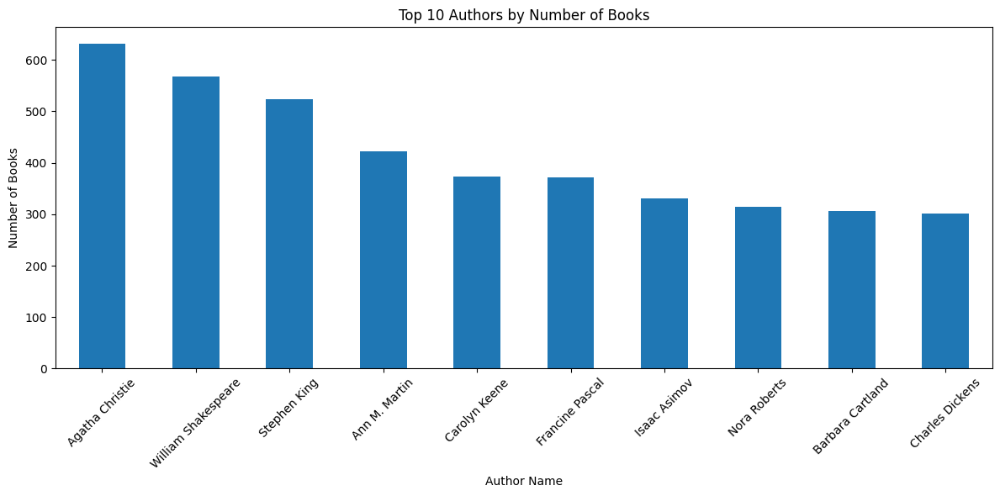
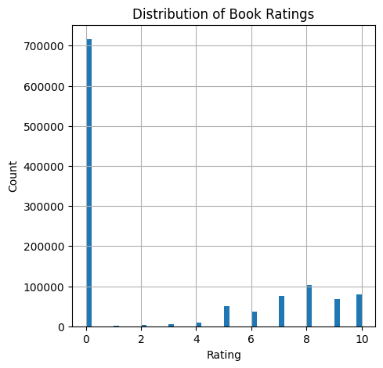
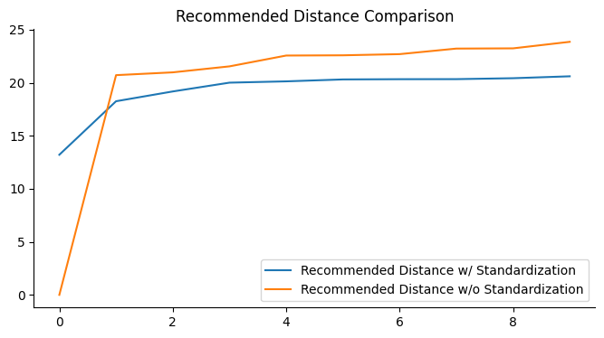

# **Recommendation System: Automating Book's Suggestion using Content-based and Collaborative Filtering**

By    : Muhammad Fatih Idlan (faiti.alfaqar@gmail.com)

This project was done to fulfil the *Machine Learning Terapan* 2nd assignment submission on Dicoding. The domain used in this project is book recommendation.

## Project Overview
In today’s digital age, the volume of content and choices available to users across platforms is overwhelming. Recommender systems play an indispensable role in navigating this vast landscape, ensuring users discover relevant and engaging content without being inundated by irrelevant options. By personalizing user experiences, these systems have become a cornerstone in industries like e-commerce, entertainment, and education, boosting user satisfaction, retention, and revenue. This project delves into the development of a book recommendation system, leveraging content-base filtering and collaborative filtering techniques with RecommenderNet model to match users with books they are most likely to enjoy. Content-based filtering is an approach in recommendation systems that utilizes information from items or users to make recommendations. While, collaborative filtering, a widely used approach, relies on user-item interactions to uncover patterns and provide recommendations. Unfortunately, content-based filtering techniques rely on item metadata, meaning they require detailed item descriptions and well-structured user profiles to generate accurate recommendations. Albeit that, collaborative filtering come up as a complementer which can make unforeseen recommendations, meaning it might offer items that are relevant to the user even if the information is not in the user's profile [[ 1 ]](https://doi.org/10.1016/j.eij.2015.06.005). The system implementation is aimed to demonstrate how machine learning can be harnessed to create a seamless and personalized user experience in the context of literature discovery.

## Business Understanding
### Problem Statement
Starting with explanation from the background above, core problems that this project aims to solve are:

* How to develop a machine learning-based recommendation system for books using content-based and colaborative filtering?
* How are the results between those two techniques?

### Objectives
According to problem statement above, this project has several objectives too, that are:

* Develop a machine learning-based recommendation system for books using content-based and colaborative filtering
* Determining high performance model with variation of recommendation techniques

### Solution Approach
To achive the objectives, we need to perform several things such as:

* Using content-based and colaborative filtering compare the results between those two methods

## Data Understanding

The dataset that used in this project is Book Recommendation Dataset, which can be accessed through kaggle [[ 2 ]](https://www.kaggle.com/datasets/arashnic/book-recommendation-dataset). This dataset consist of 3 csv files, Books.csv (271360 rows with 8 columns), Ratings.csv (1149780 rows with 3 columns), and Users.csv (27885 rows with 3 columns), also has 3 png file which irrelevant in this project. The explanation for each column can be seen below:

For Books.csv, the column are consist of:
* ISBN = International Standard Book Number of the books inside obtained from Amazon Web Services
* Book-Title = Title of the books obtained from Amazon Web Services
* Book-Author = The Author of the books obtained from Amazon Web Services
* Year-Of-Publication = Publication year of the books obtained from Amazon Web Services
* Publisher = The Publisher of the books obtained from Amazon Web Services
* Image-URL-S = URL for small sized Book's cover images point to the Amazon web site
* Image-URL-M = URL for medium sized Book's cover images point to the Amazon web site
* Image-URL-L = URL for large sized Book's cover images point to the Amazon web site

For Ratings.csv, the column are consist of:
* User-ID = Anonymized user identification in integers
* ISBN = International Standard Book Number of the books inside obtained from Amazon Web Services
* Book-Rating = Rating of the books, expressed on a scale from 1-10 (higher values denoting higher appreciation) in an explicit way, or expressed by 0 in implicit way

For Users.csv, the column are consist of:
* User-ID = Anonymized user identification in integers
* Location = Region of the reader in form of city, country
* Age = Age of the readers

### Exploratory Data Analysis (EDA)
Conducting exploratory data analysis, including univariate analysis consisting of book's rating distribution, top 10 book amount also top 10 users with the most amount of rating.

#### Univariate Analysis

*    Top 10 Author by number of books <br>

<br>
The data indicates that Agatha Christie is the most prolific author, with over 600 books to her name. This also highlights that the dataset includes multiple authors who have contributed more than one book title.

*  Distribution of Books rating <br>


| Book Rating | 0     | 1    | 2    | 3    | 4    | 5     | 6     | 7     | 8     | 9     | 10    |
|-------------|-------|------|------|------|------|-------|-------|-------|-------|-------|-------|
| Sum         | 716109| 1770 | 2759 | 5996 | 8904 | 50974 | 36924 | 76457 | 103736| 67541 | 78610 |

#### Important Key Points from EDA
*    The data indicates that Agatha Christie is the most prolific author, with over 600 books to her name. This also highlights that the dataset includes multiple authors who have contributed more than one book title
*    The output reveals that 105,283 users have provided ratings for books. A total of 340,556 unique books, identified by their ISBNs, received ratings, which range from 0 (the lowest score) to 10 (the highest score)
*   Most of the rating is retrieved in implicit way, so we can just drop that to receive more representable results 

## Data Preprocessing
This step is just include merging the dataframe of ratings and books together. This merging step is crucial for the recommendation system because it links user ratings with corresponding book details like author, title, and genre. This unified dataset enables the system to identify patterns in user preferences and recommend similar books based on content they enjoyed. Without this connection, neither content-based nor collaborative filtering techniques could effectively generate personalized recommendations.

## Data Preparation
Before model development step, it is inevitable to skip data preparation. This section is important, preparing data so the data that enter model development stage is not generating a trash model. This step is divided into two section, first is Data Preparation for Model Development w/ Content-based Filtering and w/ Collaborative Filtering.   

### Data Preparation for Model Development with Content-based Filtering
Several features in the dataset contain a significant number of missing values. It is start with data cleaning which removing empty data using pandas data frame method, drop_dropna(). Later, the dataset provided reveals a mismatch between the number of ISBNs and book titles, suggesting that certain ISBNs are linked to multiple titles. To eliminate this issue, it'll involve eliminating duplicate entries in the 'ISBN' column using data frame method, drop_duplicates().

### Data Preparation for Model Development with Collaborative Filtering
This stage involves transforming the rating data into a numerical matrix to streamline the model's ability to interpret and learn from it effectively. As part of this stage, several preprocessing steps will be applied: encoding the 'User-ID' and 'ISBN' features into integer indices, mapping 'User-ID' and 'ISBN' to their respective dataframes, and verifying critical data attributes such as the total number of users and books.

## Model Development
The data, which is likely a matrix of user-item interactions (book ratings), will be prepared and stored in a DataFrame. It is very different to develop recommendation system using content-based and collaborative filtering. Further explanation for each model development can be seen below.

### Model Development with Content-based Filtering
The model uses Content-Based Filtering to recommend items based on user preferences and item features. This stage will employed TF-IDF Vectorizer and Cosine similarity to develop recommender model. TF-IDF Vectorizer identifies key features of book titles, focusing on authors, while Cosine similarity measures how closely books are related. Sklearn's tfidfvectorizer() and cosine_similarity() functions are applied to implement these steps. The cosine similarity formula can be seen below.<br>

$$cos(\theta) = \frac{A \cdot B}{||A|| \cdot ||B||}$$
<br>

Where:
* $${A \cdot B}$$ = Product (dot) of the vectors ‘A’ and ‘B’
* $${||A||}$$ = Length (magnitude) of the two vectors ‘A’
* $${||B||}$$ = Length (magnitude) of the two vectors ‘B’

### Model Development with Collaborative Filtering
This step applies collaborative filtering to recommend books based on user ratings, assuming similar preferences predict similar choices. The model uses embeddings for users and books, calculates match scores with a sigmoid function, and incorporates user/book biases. Adapted from a Keras tutorial [[ 3 ]](https://keras.io/examples/structured_data/collaborative_filtering_movielens/), it uses Binary Crossentropy for loss, Adam for optimization, and RMSE for evaluation. The data is split into 90% training and 10% validation, due to large amount of data available. Before this, user and book title data are mapped to single values, and ratings are scaled to a 0-1 range for easier training. The RecommenderNet class, built using the Keras Model class and adapted from a Keras tutorial, is used for this process.

## Evaluation
In this step, we evaluate performance of each model that we have been developed. So, this step will be consist of evaluating Content-based filtering model and Collaborative filtering model.

### Model Evaluation with Content-based Filtering
Model performance is evaluated using Precision, Recall, and F1-Score, based on cosine similarity with a 0.5 threshold. A ground truth matrix is generated, and 10,000 samples are used for faster evaluation. Similarity values are categorized as 1 or 0, and scores are calculated with binary classification.
* Precision
It measures the proportion of recommended items that are actually relevant to the user. High precision ensures that the recommendations made by the model are relevant, reducing irrelevant recommendations. For example, in a book recommendation system, precision measures the percentage of recommended books the user finds relevant.<br> 

$$\mathbf{Precision} = \frac{TP}{TP+FP}$$

* Recall
It is quantifies the proportion of all relevant items that the model successfully recommends. High recall ensures that the model captures as many relevant items as possible. However, this may include some irrelevant ones (low precision). In our book recommendation scenario, recall measures how many of the books the user might find relevant are actually recommended.<br> 

$$\mathbf{Recall} = \frac{TP}{TP+FN}$$

* F1-Score
The F1-score is the harmonic mean of precision and recall, providing a single metric to balance both. For a recommender system, the F1-score evaluates the overall effectiveness of recommendations, ensuring neither precision nor recall is sacrificed.<br> 

$$\mathbf{F}_1 = \frac{2\cdot{Precision}\cdot{Recall}}{{Precision}+{Recall}}$$

### Model Evaluation with Collaborative Filtering
w

The metrics evaluation used for this step is Euclidean Distance<br><br>
$$d(\mathbf{p}, \mathbf{q}) = \sqrt{\sum_{i=1}^n (p_i - q_i)^2}$$
<br>

Where:
* $$d(\mathbf{p}, \mathbf{q})$$: Represents the Euclidean distance between two points 𝑝 and 𝑞
* $$\mathbf{p}_i$$ : The 𝑖-th coordinate of point 𝑝
* $$\mathbf{q}_i$$ : The 𝑖-th coordinate of point 𝑞
* 𝑛 : The number of dimensions

Euclidean distance is a measure of similarity or dissimilarity between two points in a multi-dimensional space. It calculates the straight-line distance between two vectors (e.g., user preferences, book features) in 𝑛-dimensional space. Euclidean distance helps measure the quality of predictions in terms of how closely the system matches a user's preferences. This metric is suitable for recommendation system, because it calculate the shortest straight-line distance between two points which describe the similiarity between two or more users [[ 4 ]](https://www.geeksforgeeks.org/euclidean-distance/).

### Performance of Each Recommender System


|index|Recommended Title w/ Standardization|Recommended Distance w/ Standardization|Recommended Title w/o Standardization|Recommended Distance w/o Standardization|
|---|---|---|---|---|
|0|The Bean Trees|13\.210874318725459|The Bean Trees|0\.0|
|1|She's Come Undone \(Oprah's Book Club \(Paperback\)\)|18\.25312417493501|She's Come Undone \(Oprah's Book Club \(Paperback\)\)|20\.71231517720798|
|2|Message in a Bottle|19\.175551891499328|The Book of Ruth \(Oprah's Book Club \(Paperback\)\)|20\.97617696340303|
|3|The Book of Ruth \(Oprah's Book Club \(Paperback\)\)|20\.004643098492593|A Heartbreaking Work of Staggering Genius|21\.540659228538015|
|4|Where the Heart Is \(Oprah's Book Club \(Paperback\)\)|20\.127327140139407|Prodigal Summer: A Novel|22\.561028345356956|
|5|Midnight in the Garden of Good and Evil: A Savannah Story|20\.308733957555393|Message in a Bottle|22\.58317958127243|
|6|Prodigal Summer: A Novel|20\.330839049718872|She's Come Undone \(Oprah's Book Club\)|22\.693611435820433|
|7|The Hours: A Novel|20\.336413030797384|Mystic River|23\.2163735324878|
|8|A Heartbreaking Work of Staggering Genius|20\.42423929077602|The Queen of the Damned \(Vampire Chronicles \(Paperback\)\)|23\.2379000772445|
|9|1984|20\.60415091109995|While I Was Gone|23\.853720883753127|

From metric evaluation table above, we can conclude that Nearest Neighbour with standardization data pre-processing algorithm is the most desired algortihm because has the average lowest euclidean value for top-N recommendation comparing to same model but without standardization pre-processing. Moreover, for the first row it is the first point, the book that we try to search the recommendation. Notice that the distance data without standardization starts at 0 for "The Bean Trees" because the first comparison is against itself, resulting in an inherent distance of 0 in the raw data. However, with standardization, the data undergoes centering and scaling, shifting and altering the representation of "The Bean Trees" so that even when compared to itself, the calculated distance is no longer exactly 0 due to these transformations. Although non-zero, this distance remains small relative to distances between "The Bean Trees" and other books, and standardization ultimately helps ensure fairer feature contributions in the similarity measure.

### Recommendation Function
This step is carried out to make a function to help the user, finding the recommended book based on book title that they mention.

```
def get_recommends(title="", n=5):
    try:
        book_index = df_main.index.get_loc(title)  # Get index directly
        book_values = df_main.values[book_index]  # Get values using index
    except KeyError as e:
        print('The given book', e, 'does not exist')
        return

    n+=1

    distances, indices = KNN.kneighbors([book_values], n_neighbors=n)

    # Get recommended titles directly using indices
    recommended_titles = df_main.iloc[indices[0]].index.tolist()

    recommended_titles = [x for x in recommended_titles if x != title]

    recommended_titles_str = '\n'.join(recommended_titles)

    return f"This are your top {n-1} recommended books:\n{recommended_titles_str}"
```

From code snippet above, we can takes a book title and desired number of recommendations as input, locates the book within a dataset, utilizes a pre-trained K-Nearest Neighbors (KNN) model to identify the most similar books based on their rating, filters out the original title from the results, and returns a formatted string containing a list of the top recommended books.

## Reference

*   [ 1 ] F. O. Isinkaye, Y. O. Folajimi, and B. A. Ojokoh, “Recommendation systems: Principles, methods and evaluation,” Egyptian Informatics Journal, vol. 16, no. 3, pp. 261–273, Nov. 2015, doi: 10.1016/j.eij.2015.06.005.

*   [ 2 ] [1] “Book Recommendation Dataset | Kaggle.” Accessed: Dec. 01, 2024. [Online]. Available: https://www.kaggle.com/datasets/arashnic/book-recommendation-dataset

*   [ 3 ] K. Mahmud Sujon, R. Binti Hassan, Z. Tusnia Towshi, M. A. Othman, M. Abdus Samad, and K. Choi, “When to Use Standardization and Normalization: Empirical Evidence From Machine Learning Models and XAI,” IEEE Access, vol. 12, pp. 135300–135314, 2024, doi: 10.1109/ACCESS.2024.3462434.

*   [ 4 ] “Euclidean Distance | Formula, Derivation & Solved Examples,” GeeksforGeeks. Accessed: Dec. 01, 2024. [Online]. Available: https://www.geeksforgeeks.org/euclidean-distance/
