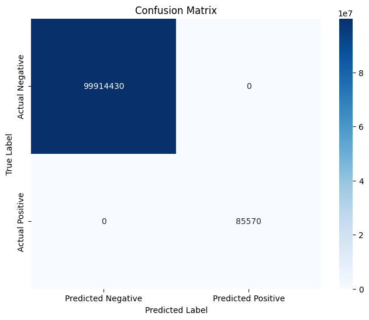
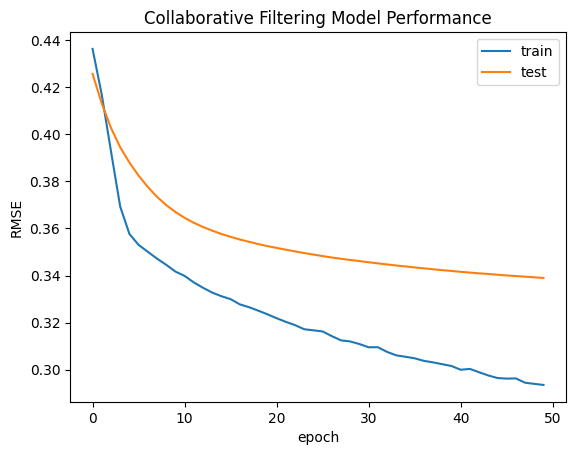

# **Recommendation System: Automating Book's Suggestion using Content-based and Collaborative Filtering**

By    : Muhammad Fatih Idlan (faiti.alfaqar@gmail.com)

This project was done to fulfil the *Machine Learning Terapan* 2nd assignment submission on Dicoding. The domain used in this project is book recommendation.

## Project Overview
In today’s digital age, the volume of content and choices available to users across platforms is overwhelming. Recommender systems play an indispensable role in navigating this vast landscape, ensuring users discover relevant and engaging content without being inundated by irrelevant options. By personalizing user experiences, these systems have become a cornerstone in industries like e-commerce, entertainment, and education, boosting user satisfaction, retention, and revenue. This project delves into the development of a book recommendation system, leveraging content-base filtering and collaborative filtering techniques with RecommenderNet model to match users with books they are most likely to enjoy. Content-based filtering is an approach in recommendation systems that utilizes information from items or users to make recommendations. While, collaborative filtering, a widely used approach, relies on user-item interactions to uncover patterns and provide recommendations. Unfortunately, content-based filtering techniques rely on item metadata, meaning they require detailed item descriptions and well-structured user profiles to generate accurate recommendations. Albeit that, collaborative filtering come up as a complementer which can make unforeseen recommendations, meaning it might offer items that are relevant to the user even if the information is not in the user's profile [[ 1 ]](https://doi.org/10.1016/j.eij.2015.06.005). The system implementation is aimed to demonstrate how machine learning can be harnessed to create a seamless and personalized user experience in the context of literature discovery.

## Business Understanding
### Problem Statement
Starting with explanation from the background above, core problems that this project aims to solve are:

* How to develop a machine learning-based recommendation system for books using content-based and colaborative filtering?
* How are the results between those two techniques?

### Objectives
According to problem statement above, this project has several objectives too, that are:

* Develop a machine learning-based recommendation system for books using content-based and colaborative filtering
* Determining high performance model with variation of recommendation techniques

### Solution Approach
To achive the objectives, we need to perform several things such as:

* Using content-based and colaborative filtering compare the results between those two methods

## Data Understanding

The dataset that used in this project is Book Recommendation Dataset, which can be accessed through kaggle [[ 2 ]](https://www.kaggle.com/datasets/arashnic/book-recommendation-dataset). This dataset consist of 3 csv files, Books.csv (271360 rows with 8 columns), Ratings.csv (1149780 rows with 3 columns), and Users.csv (27885 rows with 3 columns), also has 3 png file which irrelevant in this project. The explanation for each column can be seen below:

For Books.csv, the column are consist of:
* ISBN = International Standard Book Number of the books inside obtained from Amazon Web Services
* Book-Title = Title of the books obtained from Amazon Web Services
* Book-Author = The Author of the books obtained from Amazon Web Services
* Year-Of-Publication = Publication year of the books obtained from Amazon Web Services
* Publisher = The Publisher of the books obtained from Amazon Web Services
* Image-URL-S = URL for small sized Book's cover images point to the Amazon web site
* Image-URL-M = URL for medium sized Book's cover images point to the Amazon web site
* Image-URL-L = URL for large sized Book's cover images point to the Amazon web site

For Ratings.csv, the column are consist of:
* User-ID = Anonymized user identification in integers
* ISBN = International Standard Book Number of the books inside obtained from Amazon Web Services
* Book-Rating = Rating of the books, expressed on a scale from 1-10 (higher values denoting higher appreciation) in an explicit way, or expressed by 0 in implicit way

For Users.csv, the column are consist of:
* User-ID = Anonymized user identification in integers
* Location = Region of the reader in form of city, country
* Age = Age of the readers

### Exploratory Data Analysis (EDA)
Conducting exploratory data analysis, including univariate analysis consisting of book's rating distribution, top 10 book amount also top 10 users with the most amount of rating.

#### Univariate Analysis

*    Top 10 Author by number of books  

 
The data indicates that Agatha Christie is the most prolific author, with over 600 books to her name. This also highlights that the dataset includes multiple authors who have contributed more than one book title.

*  Distribution of Books rating  

| Book Rating | 0     | 1    | 2    | 3    | 4    | 5     | 6     | 7     | 8     | 9     | 10    |
|-------------|-------|------|------|------|------|-------|-------|-------|-------|-------|-------|
| Sum         | 716109| 1770 | 2759 | 5996 | 8904 | 50974 | 36924 | 76457 | 103736| 67541 | 78610 |

#### Important Key Points from EDA
*    The data indicates that Agatha Christie is the most prolific author, with over 600 books to her name. This also highlights that the dataset includes multiple authors who have contributed more than one book title
*    The output reveals that 105,283 users have provided ratings for books. A total of 340,556 unique books, identified by their ISBNs, received ratings, which range from 0 (the lowest score) to 10 (the highest score)
*   Most of the rating is retrieved in implicit way, so we can just drop that to receive more representable results 

## Data Preprocessing
This step is just include merging the dataframe of ratings and books together. This merging step is crucial for the recommendation system because it links user ratings with corresponding book details like author, title, and genre. This unified dataset enables the system to identify patterns in user preferences and recommend similar books based on content they enjoyed. Without this connection, neither content-based nor collaborative filtering techniques could effectively generate personalized recommendations.

## Data Preparation
Before model development step, it is inevitable to skip data preparation. This section is important, preparing data so the data that enter model development stage is not generating a trash model. This step is divided into two section, first is Data Preparation for Model Development w/ Content-based Filtering and w/ Collaborative Filtering.   

### Data Preparation for Model Development with Content-based Filtering
Several features in the dataset contain a significant number of missing values. It is start with data cleaning which removing empty data using pandas data frame method, drop_dropna(). Later, the dataset provided reveals a mismatch between the number of ISBNs and book titles, suggesting that certain ISBNs are linked to multiple titles. To eliminate this issue, it'll involve eliminating duplicate entries in the 'ISBN' column using data frame method, drop_duplicates().

### Data Preparation for Model Development with Collaborative Filtering
This stage involves transforming the rating data into a numerical matrix to streamline the model's ability to interpret and learn from it effectively. As part of this stage, several preprocessing steps will be applied: encoding the 'User-ID' and 'ISBN' features into integer indices, mapping 'User-ID' and 'ISBN' to their respective dataframes, and verifying critical data attributes such as the total number of users and books.

## Model Development
The data, which is likely a matrix of user-item interactions (book ratings), will be prepared and stored in a DataFrame. It is very different to develop recommendation system using content-based and collaborative filtering. Further explanation for each model development can be seen below.

### Model Development with Content-based Filtering
The model uses Content-Based Filtering to recommend items based on user preferences and item features. This stage will employed TF-IDF Vectorizer and Cosine similarity to develop recommender model. TF-IDF Vectorizer identifies key features of book titles, focusing on authors, while Cosine similarity measures how closely books are related. Sklearn's tfidfvectorizer() and cosine_similarity() functions are applied to implement these steps. The cosine similarity formula can be seen below. 

$$cos(\theta) = \frac{A \cdot B}{||A|| \cdot ||B||}$$
 

Where:
* $${A \cdot B}$$ = Product (dot) of the vectors ‘A’ and ‘B’
* $${||A||}$$ = Length (magnitude) of the two vectors ‘A’
* $${||B||}$$ = Length (magnitude) of the two vectors ‘B’

### Model Development with Collaborative Filtering
This step applies collaborative filtering to recommend books based on user ratings, assuming similar preferences predict similar choices. The model uses embeddings for users and books, calculates match scores with a sigmoid function, and incorporates user/book biases. Adapted from a Keras tutorial [[ 3 ]](https://keras.io/examples/structured_data/collaborative_filtering_movielens/), it uses Binary Crossentropy for loss, Adam for optimization, and RMSE for evaluation. The data is split into 90% training and 10% validation, due to large amount of data available. Before this, user and book title data are mapped to single values, and ratings are scaled to a 0-1 range for easier training. The RecommenderNet class, built using the Keras Model class and adapted from a Keras tutorial, is used for this process.

## Evaluation
In this step, we evaluate performance of each model that we have been developed. So, this step will be consist of evaluating Content-based filtering model and Collaborative filtering model.

### Model Evaluation with Content-based Filtering
Model performance is evaluated using Precision, Recall, and F1-Score, based on cosine similarity with a 0.5 threshold. A ground truth matrix is generated, and 10,000 samples are used for faster evaluation. Similarity values are categorized as 1 or 0, and scores are calculated with binary classification.
* Precision
It measures the proportion of recommended items that are actually relevant to the user. High precision ensures that the recommendations made by the model are relevant, reducing irrelevant recommendations. For example, in a book recommendation system, precision measures the percentage of recommended books the user finds relevant.  

$$\mathbf{Precision} = \frac{TP}{TP+FP}$$

* Recall
It is quantifies the proportion of all relevant items that the model successfully recommends. High recall ensures that the model captures as many relevant items as possible. However, this may include some irrelevant ones (low precision). In our book recommendation scenario, recall measures how many of the books the user might find relevant are actually recommended.  

$$\mathbf{Recall} = \frac{TP}{TP+FN}$$

* F1-Score
The F1-score is the harmonic mean of precision and recall, providing a single metric to balance both. For a recommender system, the F1-score evaluates the overall effectiveness of recommendations, ensuring neither precision nor recall is sacrificed.  

$$\mathbf{F}_1 = \frac{2\cdot{Precision}\cdot{Recall}}{{Precision}+{Recall}}$$

Where:
* TP = True Positive (When the model correctly predicts a positive outcome)
* TN = True Negative (When the model correctly predicts a negative outcome)
* FP = False Positive (When the model incorrectly predicts a positive outcome)
* FN = False Negative (When the model incorrectly predicts a negative outcome)
### Model Evaluation with Collaborative Filtering
In the Collaborative Filtering model, RMSE (Root Mean Squared Error) is used to evaluate how accurately the model predicts continuous values by comparing predicted and actual values. RMSE helps assess the model's ability to predict user preferences. Root Mean Squared Error (RMSE) is a commonly used evaluation metric for measuring the accuracy of predictions in recommender systems [[ 4 ]](https://doi.org/10.1016/j.knosys.2015.12.025).  

$$RMSE(y, x) = \sqrt{\frac{\sum_{i=0}^{N - 1} (y_i - x_i)^2}{N}}$$

 Where:
* N = Amount of the data
* i = Index of the data
* y = Actual rating
* x = Predicted rating

## Performance of Each Recommender System
### Performance of Content-based Filtering
The evaluation results show that the model performs excellently, with a Precision of 1.0 (no false positives), a Recall of 1.0 (identifying nearly all relevant items), and an F1 Score close to 1.0, indicating a strong balance between precision and recall. These results demonstrate that the model is highly effective at recommending items using content-based filtering.
  

### Performance of Collaborative Filtering
The RMSE evaluation visualization shows that the model converges after about 50 epochs, achieving a low MSE value. The final error is 0.2924, with a validation error of 0.3389. These results indicate good performance, as a lower RMSE means better predictions of user preferences, making the recommendation system accurate.
  

## Recommendation
### Recommendation for Content-based Filtering
This step is carried out to make a function to help the user, finding the recommended book based on book's content. The sample book title that used to test this step is 'Joyful Noise (rpkg) : Poems for Two Voices' by Paul Fleischman. The top 10 that we got can be seen below.
|Index|Book Title|Book Author|
|---|---|---|
|1|Graven Images: Three Stories|Paul Fleischman|
|2|The Path of the Pale Horse \(Charlotte Zolotow Book\)|Paul Fleischman|
|3|Seedfolks|Paul Fleischman|
|4|Seedfolks|Paul Fleischman|
|5|The Borning Room|Paul Fleischman|
|6|The Borning Room|Paul Fleischman|
|7|The Half-a-Moon Inn|Paul Fleischman|
|8|Seedfolks|Paul Fleischman|
|9|Seedfolks|Paul Fleischman|
|10|The Borning Room|Paul Fleischman|

 It can be seen that all of the recommendation for this book share one the same author, Paul Fleischman. This happen because it measure the most relevant books with 'Joyful Noise (rpkg) : Poems for Two Voices' book.

### Recommendation for Collaborative Filtering
This step is carried out to make a function to help the user, finding the recommended book based on user's rating and applied it into other user's rating. The sample user that used to test this step is have a user id of 3363 with highest rating book from the user is 'Joyful Noise (rpkg) : Poems for Two Voices' by Paul Fleischman. The top 10 that we got can be seen below.
|Index|Book Title|Book Author|
|---|---|---|
|1|The Complete Idiot's Guide to Cycling|Vic Armijo|
|2|A Kiss on the Nose Turns Anger Aside|Charles M\. Schulz|
|3|The Dominant Blonde|Alisa Kwitney|
|4|The Last Report on the Miracles at Little No Horse|Louise Erdrich|
|5|Ties That Bind|Phillip Margolin|
|6|Inventing the Abbotts and Other Stories \(Harper\&amp; Row, 1987\)|Sue Miller|
|7|Kingmaker's Sword \(The Rune Blade Trilogy, Book 1\)|Ann Marston|
|8|Legend|Sharon Sala|
|9|For My Daughters|Barbara Delinsky|
|10|Memoirs of a Geisha Uk|Arthur Golden|

 With the same book title, it can be seen that the top 10 recommendation for Collaborative Filtering are more various comparing to Content-based Filtering. This is gonna be one of the proof that Content-based Filtering arise cold start issues.

## Reference

*   [ 1 ] F. O. Isinkaye, Y. O. Folajimi, and B. A. Ojokoh, “Recommendation systems: Principles, methods and evaluation,” Egyptian Informatics Journal, vol. 16, no. 3, pp. 261–273, Nov. 2015, doi: 10.1016/j.eij.2015.06.005.

*   [ 2 ] [1] “Book Recommendation Dataset | Kaggle.” Accessed: Dec. 01, 2024. [Online]. Available: https://www.kaggle.com/datasets/arashnic/book-recommendation-dataset

*   [ 3 ] S. Banerjee, “Keras documentation: Collaborative Filtering for Movie Recommendations.” Accessed: Dec. 14, 2024. [Online]. Available: https://keras.io/examples/structured_data/collaborative_filtering_movielens/

*   [ 4 ] F. Zhang, T. Gong, V. E. Lee, G. Zhao, C. Rong, and G. Qu, “Fast algorithms to evaluate collaborative filtering recommender systems,” Knowledge-Based Systems, vol. 96, pp. 96–103, Mar. 2016, doi: 10.1016/j.knosys.2015.12.025.
